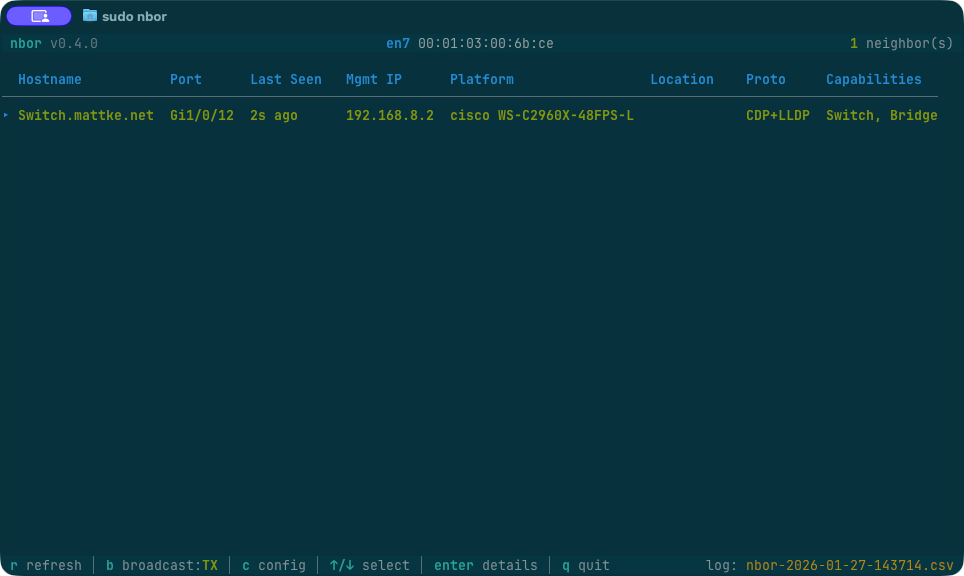
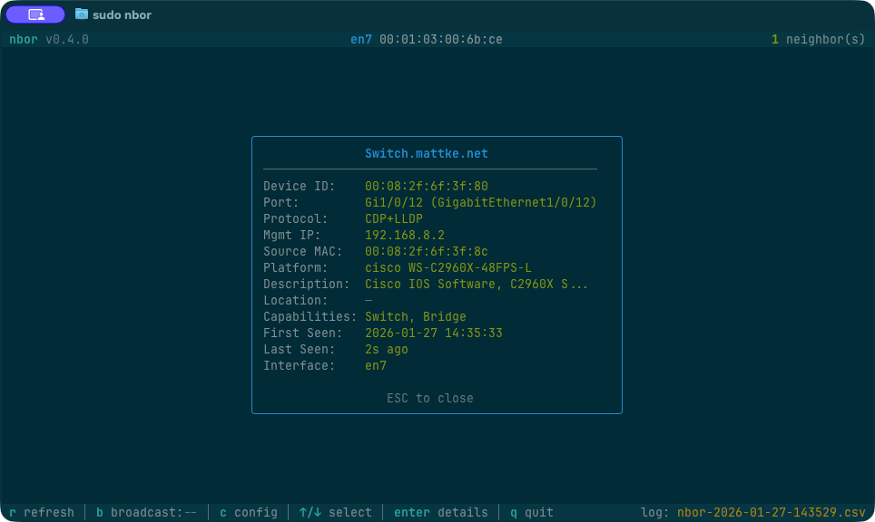
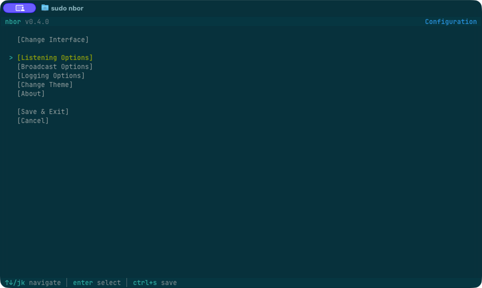
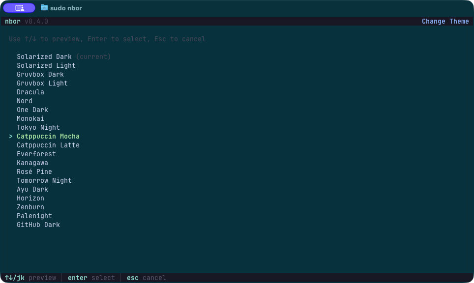

# nbor

A polished TUI tool for discovering network neighbors via CDP (Cisco Discovery Protocol) and LLDP (Link Layer Discovery Protocol).

## Features

- **Interface Selection**: Automatically filters to show only wired Ethernet interfaces
- **Protocol Support**: Listens for both CDP and LLDP packets (toggleable)
- **Broadcasting**: Optionally broadcast CDP/LLDP frames to announce your system to the network
- **Configuration Menu**: In-app configuration for system identity, listening, and broadcasting options
- **Rich Neighbor Information**:
  - Switch/device hostname
  - Port ID (the port you're connected to)
  - Management IP address
  - Platform/model
  - System description
  - SNMP Location (if available)
  - Device capabilities (Router, Switch, Bridge, AP, Phone, etc.)
  - Protocol type (CDP or LLDP)
  - First/last seen timestamps
- **Neighbor Detail View**: Press Enter to see all information for a selected neighbor in a popup
- **Visual Alerts**: New neighbors are highlighted and trigger a terminal bell
- **Stale Detection**: Neighbors not seen recently are grayed out (configurable timeout)
- **CSV Logging**: All discoveries are logged to a timestamped CSV file (new log on listen setting changes)
- **Self-filtering**: Own broadcasts are automatically filtered from the neighbor list
- **Auto-Select Interface**: Automatically starts capturing if only one wired interface is available
- **20 Built-in Themes**: Solarized, Gruvbox, Dracula, Nord, Tokyo Night, Catppuccin, and more
- **Configuration File**: Persistent settings with XDG support on Linux/macOS and %APPDATA% on Windows

## Platform Support

- macOS
- Linux
- Windows

## Requirements

### macOS

```bash
# libpcap is included with macOS
# No additional dependencies needed
```

### Linux

```bash
# Requires libpcap-dev
sudo apt install libpcap-dev  # Debian/Ubuntu
sudo dnf install libpcap-devel  # Fedora/RHEL
```

### Windows

```powershell
# Requires Npcap installed (https://npcap.com)
# During installation, check "WinPcap API-compatible Mode"
```

## Building

### Linux/macOS

```bash
go build -o nbor
```

### Windows

```powershell
go build -o nbor.exe
```

## Usage

The tool requires elevated privileges for packet capture.

### Basic Usage

```bash
# Linux/macOS
sudo ./nbor

# Windows (Run as Administrator)
.\nbor.exe
```

### Command Line Options

```
Usage:
  nbor [options] [interface]

General Options:
  -t, --theme <name>      Use specified theme (session only)
  --list-themes           List available themes
  -l, --list-interfaces   List available network interfaces
  --list-all-interfaces   List all interfaces (including filtered)
  -v, --version           Show version
  -h, --help              Show this help

Identity Options:
  --name <string>         System name to advertise (default: hostname)
  --description <string>  System description to advertise

Listening Options:
  --cdp-listen            Enable CDP listening (default)
  --no-cdp-listen         Disable CDP listening
  --lldp-listen           Enable LLDP listening (default)
  --no-lldp-listen        Disable LLDP listening

Broadcasting Options:
  --cdp-broadcast         Enable CDP broadcasting
  --no-cdp-broadcast      Disable CDP broadcasting (default)
  --lldp-broadcast        Enable LLDP broadcasting
  --no-lldp-broadcast     Disable LLDP broadcasting (default)
  --broadcast             Enable both CDP and LLDP broadcasting
  --broadcast-on-startup  Start broadcasting immediately (default: off)
  --interval <seconds>    Advertise interval (default: 5)
  --ttl <seconds>         TTL/hold time (default: 20)

Capability Options:
  --capabilities <list>   Comma-separated capabilities to advertise:
                          router, bridge, station (default: station)

Interface Options:
  --auto-select           Auto-select if only one wired interface is up (default)
  --no-auto-select        Always show interface picker
```

### Examples

```bash
# Interactive interface picker (default)
sudo ./nbor

# Start capture directly on a specific interface
sudo ./nbor eth0                    # Linux
sudo ./nbor en0                     # macOS (with warning for WiFi)
.\nbor.exe "Ethernet 2"             # Windows (interface with spaces)

# Use a different theme for this session
sudo ./nbor --theme dracula
sudo ./nbor --theme tokyo-night
sudo ./nbor -t catppuccin-mocha eth0

# Start with broadcasting enabled
sudo ./nbor --broadcast
sudo ./nbor --broadcast --interval 10

# Custom system name, LLDP only
sudo ./nbor --name "my-workstation" --no-cdp-listen --lldp-broadcast

# Advertise as a router
sudo ./nbor --broadcast --capabilities router,station

# List available interfaces
sudo ./nbor -l

# List all interfaces including filtered ones (WiFi, virtual, etc.)
sudo ./nbor --list-all-interfaces

# List available themes
./nbor --list-themes
```

### Filtered Interface Warning

When you specify an interface that would normally be filtered (WiFi, virtual, tunnel, etc.), nbor will warn but allow you to proceed:

```
Warning: 'en0' appears to be a WiFi interface
CDP/LLDP protocols are typically only used on wired networks.
Continuing anyway...
```

## Interface

### Interface Selection

On launch, select a network interface using arrow keys and press Enter.

### Capture View

Once capturing, the main view shows discovered neighbors in a table.



**Hotkeys:**
- `↑/↓` or `j/k` - Navigate/select neighbors
- `Enter` - View detailed information for selected neighbor
- `r` - Refresh display
- `b` - Toggle broadcasting on/off
- `c` - Open configuration menu
- `Esc` - Close detail popup
- `Ctrl+C` or `q` - Quit



**Status Bar:**
The footer shows the current broadcast status (`TX` when broadcasting, `--` when not).

### Configuration Menu

Press `c` from the capture view to open the configuration menu with these submenus:
- **Change Interface**: Return to the interface selection screen
- **Listening Options**: CDP/LLDP listening, capability filters, staleness timeouts
- **Broadcast Options**: System identity, CDP/LLDP broadcasting, interval, TTL, capabilities
- **Logging Options**: Enable/disable logging, set log directory
- **Change Theme**: Browse and preview all 20 themes with live preview
- **About**: Version info and links



Navigate with arrow keys (including left/right for multi-option rows), toggle with Space/Enter. Press Ctrl+S or select Save & Exit to save changes. ESC returns from submenus; select Cancel to discard all changes.

**Note:** The `b` key toggles broadcasting on/off at runtime without changing your saved configuration. This allows quick enabling/disabling without modifying your persistent settings.

## CSV Log Files

Each session creates a CSV log file in the current directory with the format:
```
nbor-YYYY-MM-DD-HHMMSS.csv
```

The log contains all neighbor announcements with timestamps.

## Architecture

The codebase is structured for maintainability and future multi-interface support:

```
nbor/
├── main.go           # Application entry point
├── broadcast/        # CDP/LLDP packet construction and transmission
├── capture/          # Packet capture with gopacket/libpcap
├── cli/              # Command-line argument parsing
├── config/           # Configuration file loading and validation (TOML)
├── logger/           # CSV logging
├── parser/           # CDP and LLDP protocol parsing
├── platform/         # OS-specific interface detection (Linux/macOS/Windows)
├── protocol/         # Shared protocol constants and utilities
├── tui/              # Terminal UI with bubbletea/lipgloss
├── types/            # Shared data types (Neighbor, InterfaceInfo)
└── version/          # Version constant
```

## Theming

nbor includes 20 built-in themes based on the Base16 color specification.

### Available Themes

| Slug | Display Name |
|------|--------------|
| `solarized-dark` | Solarized Dark (default) |
| `solarized-light` | Solarized Light |
| `gruvbox-dark` | Gruvbox Dark |
| `gruvbox-light` | Gruvbox Light |
| `dracula` | Dracula |
| `nord` | Nord |
| `one-dark` | One Dark |
| `monokai` | Monokai |
| `tokyo-night` | Tokyo Night |
| `catppuccin-mocha` | Catppuccin Mocha |
| `catppuccin-latte` | Catppuccin Latte |
| `everforest` | Everforest |
| `kanagawa` | Kanagawa |
| `rose-pine` | Rosé Pine |
| `tomorrow-night` | Tomorrow Night |
| `ayu-dark` | Ayu Dark |
| `horizon` | Horizon |
| `zenburn` | Zenburn |
| `palenight` | Palenight |
| `github-dark` | GitHub Dark |

Use `nbor --list-themes` to see available themes. Theme names use hyphens (not spaces), so "Tokyo Night" becomes `tokyo-night`.



**For a single session:**
```bash
sudo ./nbor --theme dracula
```

**To set permanently**, see the Configuration section below.

## Configuration

nbor stores settings in a TOML config file that is created automatically on first run.

### Config File Locations

| Platform | Location |
|----------|----------|
| Linux    | `$XDG_CONFIG_HOME/nbor/config.toml` (default: `~/.config/nbor/config.toml`) |
| macOS    | `$XDG_CONFIG_HOME/nbor/config.toml` (default: `~/.config/nbor/config.toml`) |
| Windows  | `%APPDATA%\nbor\config.toml` |

### Example config.toml

```toml
# Theme name (use slug format with hyphens)
theme = "tokyo-night"

# System identity (used when broadcasting)
system_name = ""           # Empty = use hostname
system_description = ""    # Empty = "nbor network neighbor discovery tool"

# Listening settings
cdp_listen = true
lldp_listen = true

# Broadcasting settings
cdp_broadcast = false
lldp_broadcast = false
broadcast_on_startup = false  # If true, start broadcasting automatically
advertise_interval = 5     # Seconds between broadcasts
ttl = 20                   # Time-to-live / hold time in seconds

# Capabilities to advertise (router, bridge, station)
capabilities = ["station"]

# Display filtering (empty = show all neighbors)
filter_capabilities = []   # e.g., ["router", "bridge"] to only show routers/bridges

# Staleness settings
staleness_timeout = 180    # Seconds before graying out (default 3 min)
stale_removal_time = 0     # Seconds before removal (0 = never remove)

# Logging
logging_enabled = true
log_directory = ""         # Empty = current directory

# Interface selection
auto_select_interface = true  # Auto-select if only one wired interface is up
```

### Configuration Validation

nbor automatically validates configuration values on load. Invalid values are reset to defaults:
- `advertise_interval`: 1-300 seconds (default: 5)
- `ttl`: 1-65535 seconds (default: 20)
- `staleness_timeout`: 0-86400 seconds (default: 180)
- `stale_removal_time`: 0-86400 seconds (default: 0)

## License

[MIT](LICENSE)

---

*This project was developed with assistance from [Claude](https://claude.ai), an AI assistant by Anthropic.*
